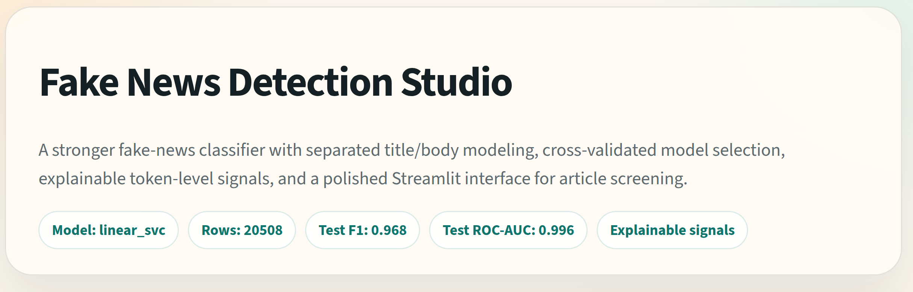
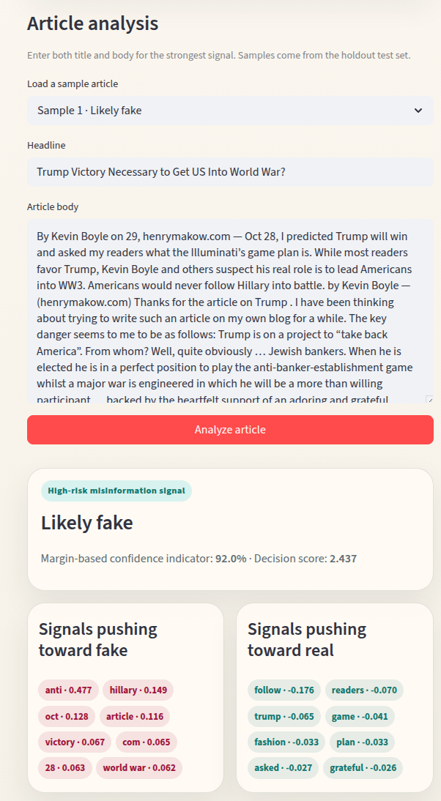
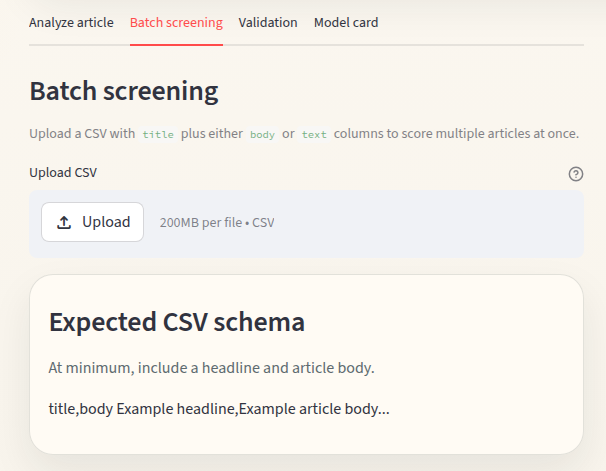
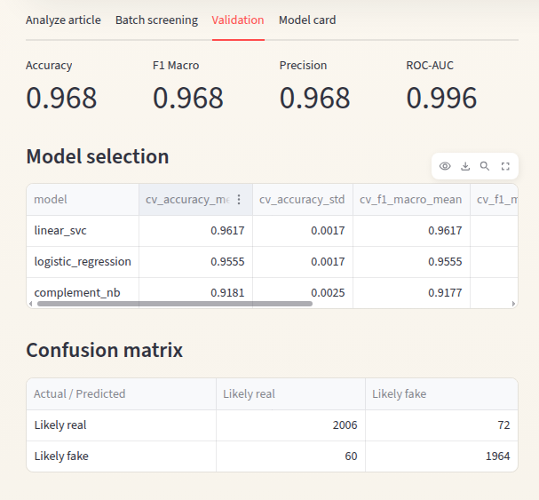
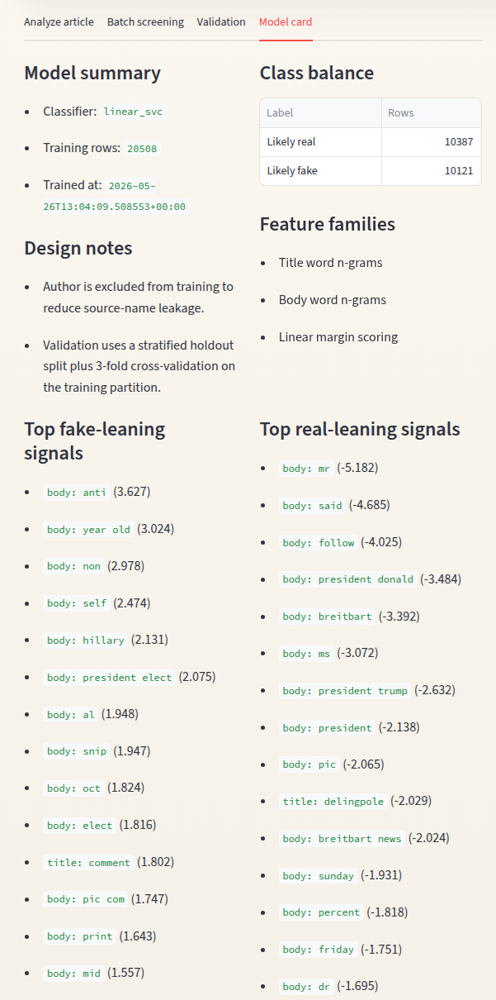

# Fake News Detection Studio

A production-style fake-news screening application built with `scikit-learn` and `Streamlit`. The project upgrades a simple text classifier into a more complete ML product with structured preprocessing, cross-validated model selection, holdout evaluation artifacts, explainable signals, and batch scoring.

## Interface Preview

### Hero and product overview



### Single-article analysis

Use the main workflow to screen a headline and article body, inspect the model verdict, and review token-level evidence pushing the classifier toward either class.



### Batch screening

Upload a CSV containing `title` plus either `body` or `text`, score the full batch, and export the enriched results.



### Validation view

The app exposes model metrics, a comparison table for candidate models, and the holdout confusion matrix directly in the UI.



### Model card

The model card summarizes the training setup, class balance, and the strongest global lexical signals for both classes.



## What This Version Adds

- Separate TF-IDF feature spaces for headlines and article bodies
- Cross-validated model benchmarking across `LinearSVC`, `LogisticRegression`, and `ComplementNB`
- Leakage-aware preprocessing that removes noisy source and timestamp artifacts
- Holdout validation metrics, confusion matrix, top lexical signals, and sample articles
- Token-level explanation panels for individual predictions
- Batch CSV screening with downloadable results
- Deployment-ready Streamlit entrypoint
- Cleaner project structure for retraining, inference, and deployment

## Validation Snapshot

Current trained artifact on `data/raw/News.csv`:

- Holdout accuracy: `0.968`
- Holdout macro F1: `0.968`
- Holdout macro precision: `0.968`
- Holdout ROC-AUC: `0.996`
- Holdout rows: `4102`
- Best model: `linear_svc`

Cross-validation leaderboard on the training split:

| Model | CV Accuracy | CV Macro F1 |
| --- | ---: | ---: |
| `linear_svc` | `0.962` | `0.962` |
| `logistic_regression` | `0.956` | `0.955` |
| `complement_nb` | `0.918` | `0.918` |

Holdout confusion matrix:

| Actual \ Predicted | Likely real | Likely fake |
| --- | ---: | ---: |
| `Likely real` | `2006` | `72` |
| `Likely fake` | `60` | `1964` |

## Product Workflows

### 1. Single-article analysis

- Paste a headline and article body
- Review the model verdict, margin-based confidence, and token-level signals
- Load curated examples from the holdout set to inspect behavior quickly

### 2. Batch screening

- Upload a CSV with `title` plus either `body` or `text`
- Score multiple rows in one pass
- Download the enriched CSV with predictions, confidence, and decision scores

## Local Run

```bash
python -m venv .venv
source .venv/bin/activate
pip install -r requirements.txt
streamlit run FakenNewsApp.py
```

Or use the helper script:

```bash
./scripts/run_local.sh
```

## Retraining

```bash
python scripts/train_model.py
python scripts/smoke_test.py
```

Training writes the app artifacts to `artifacts/`:

- `fake_news_detector.joblib`
- `validation_metrics.json`
- `model_selection.json`
- `confusion_matrix.json`
- `top_terms.json`
- `sample_articles.json`

## Project Layout

```text
.
├── artifacts/               # trained model bundle and validation outputs
├── data/raw/News.csv        # training dataset
├── notebooks/               # exploration notebook
├── scripts/                 # training and smoke-test helpers
├── src/                     # preprocessing, modeling, inference, UI
├── FakenNewsApp.py          # Streamlit entrypoint
└── requirements.txt
```

## Notes

- This system is a text-pattern classifier, not a factual verification engine.
- The confidence indicator is derived from model margin, not a calibrated probability of truth.
- The app is best used for screening, prioritization, and demonstration of applied ML workflow.
